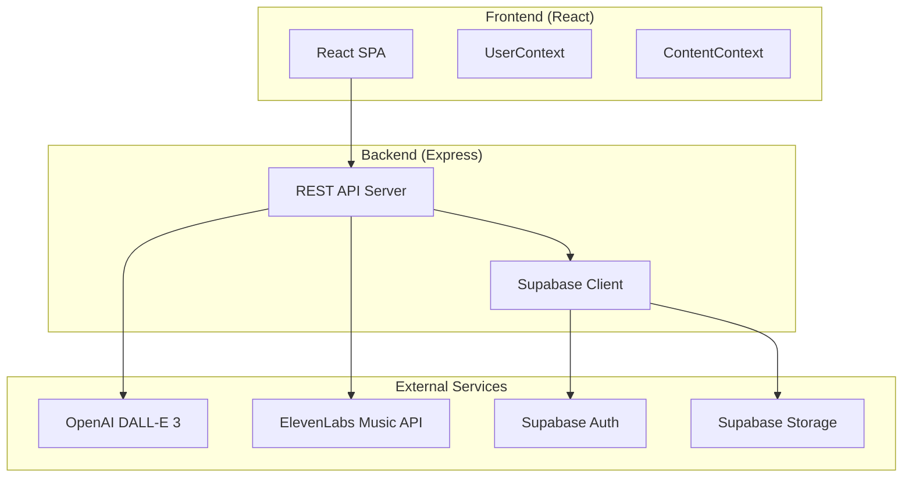
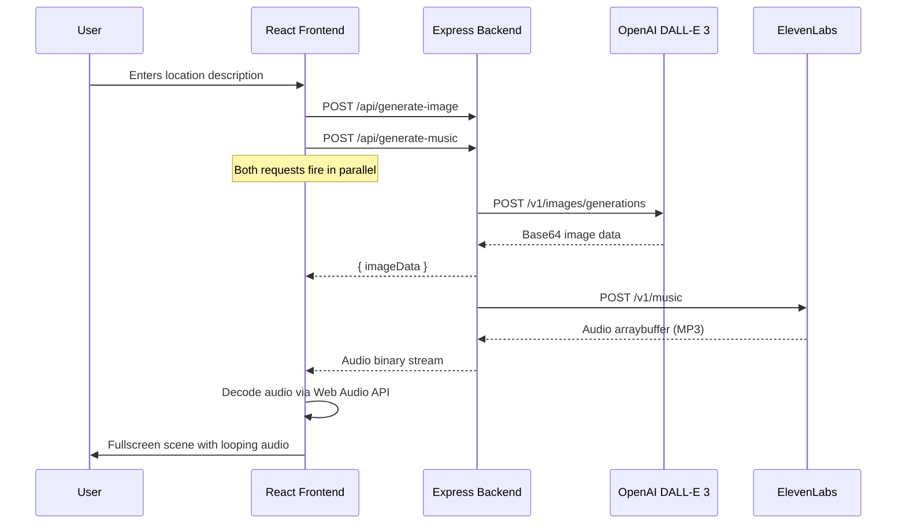
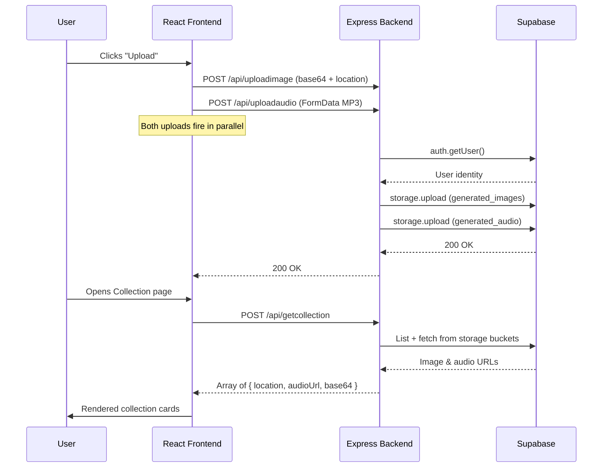
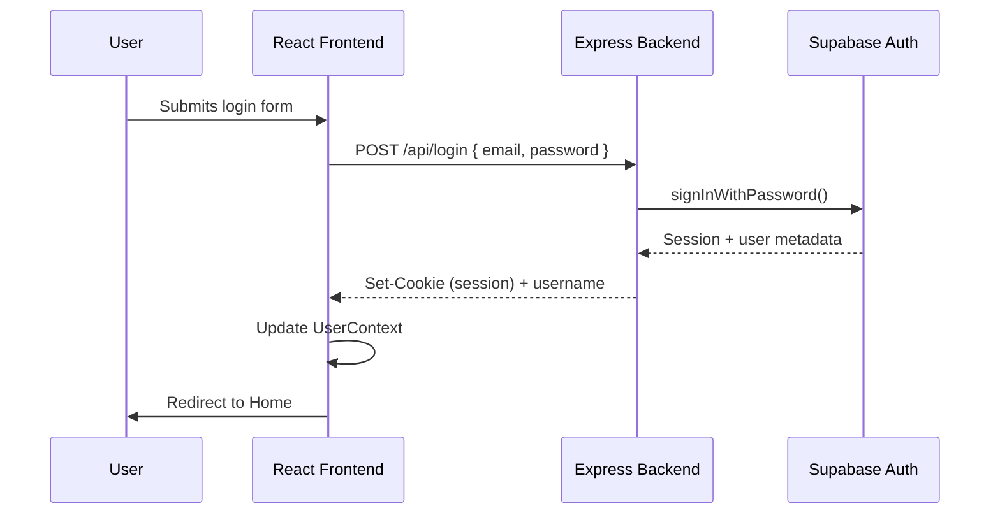

# Kree

**A generative lo-fi study environment built with React and Express.**

Kree allows users to describe any real or imagined location and instantly produces an immersive study scene — a stylized lo-fi illustration paired with a matching instrumental soundtrack. The result is a fullscreen, ambient workspace designed to aid focus and relaxation.

Authenticated users can save their generated environments to a personal collection and revisit them at any time.

---

## Table of Contents

1. [Features](#features)
2. [Architecture](#architecture)
3. [Tech Stack](#tech-stack)
4. [Project Structure](#project-structure)
5. [Getting Started](#getting-started)
6. [Environment Variables](#environment-variables)
7. [Deployment](#deployment)
8. [API Reference](#api-reference)
9. [Contributing](#contributing)
10. [License](#license)

---

## Features

- **AI Image Generation** — Produces a stylized, cozy lo-fi illustration from a user input location using OpenAI's DALL-E 3 model.
- **AI Music Generation** — Generates a lo-fi instrumental based on the described location via the ElevenLabs music API.
- **User Authentication** — Registration and login via Supabase Auth, with session management handled through secure HTTP cookies.
- **Saving Generated Content** — Authenticated users can upload generated scenes (image + audio) to cloud storage and browse their saved collection.

---

## Architecture

### High-Level Overview



### Request Flow — Generation



### Request Flow — Upload & Collection



### Authentication Flow



---

## Tech Stack

| Layer        | Technology                          |
|:-------------|:------------------------------------|
| Frontend     | React 18, React Router, styled-components |
| Backend      | Node.js, Express 4                  |
| Authentication | Supabase Auth (SSR cookie flow)   |
| Storage      | Supabase Storage (image + audio buckets) |
| Image Generation | OpenAI DALL-E 3                |
| Music Generation | ElevenLabs Music API            |
| Containerization | Docker, Docker Compose          |
| CI/CD        | GitHub Actions, AWS Amplify / Vercel |
| Hosting      | Heroku (backend), Vercel / Amplify (frontend) |

---

## Project Structure

```
Kree/
├── backend/
│   ├── server.js            # Express API — all route handlers
│   ├── lib/
│   │   └── supabase.js      # Supabase SSR client factory
│   ├── Dockerfile           # Production Docker image (Node 22 Alpine)
│   ├── compose.yaml         # Docker Compose service definition
│   ├── package.json
│
├── frontend/
│   ├── src/
│   │   ├── App.jsx          # Root component — routing & context providers
│   │   ├── App.css          # Global styles
│   │   ├── index.js         # React entry point
│   │   └── Pages/
│   │       ├── Home.jsx           # Landing page — location input & generation trigger
│   │       ├── GeneratedPage.jsx  # Fullscreen scene — image, audio, controls
│   │       ├── Collection.jsx     # Saved scenes gallery
│   │       ├── Login.jsx          # Login form
│   │       ├── Registration.jsx   # Registration form
│   │       ├── SignOut.jsx        # Sign-out handler
│   │       ├── Header.jsx         # Hamburger nav — adapts to auth state
│   │       ├── UserContext.jsx    # React Context for authenticated user
│   │       └── ContentContext.jsx # React Context for generated content
│   ├── public/
│   │   ├── index.html
│   │   └── logo.png
│   ├── amplify.yml          # AWS Amplify build spec
│   ├── package.json
│
├── .github/
│   └── workflows/
│       └── backend-test.yml # CI — Docker build verification on push/PR
│
└── .gitignore
```

---

## Getting Started

### Prerequisites

- Node.js >= 18
- npm
- A Supabase project with Auth enabled and two storage buckets: `generated_images` and `generated_audio`
- An OpenAI API key with DALL-E 3 access
- An ElevenLabs API key with music generation access

### Installation

```bash
# Clone the repository
git clone https://github.com/<your-username>/Kree.git
cd Kree

# Install backend dependencies
cd backend
npm install

# Install frontend dependencies
cd ../frontend
npm install
```

### Running Locally

**Backend:**

```bash
cd backend
# Create a .env file (see Environment Variables below)
npm start
# Server starts on http://localhost:4000
```

**Frontend:**

```bash
cd frontend
# .env.development should already point to http://localhost:4000/api
npm start
# App opens on http://localhost:3000
```

### Running with Docker

```bash
cd backend
docker compose up --build
# Backend available on http://localhost:4000
```

---

## Environment Variables

### Backend (`backend/.env`)

| Variable                    | Description                              |
|:----------------------------|:-----------------------------------------|
| `PORT`                      | Server port (default: `4000`)            |
| `FRONTEND_URL`              | Allowed CORS origin                      |
| `OPENAI_API_KEY`            | OpenAI API key for DALL-E 3              |
| `ELEVEN_API_KEY`            | ElevenLabs API key                       |
| `SUPABASE_URL`              | Supabase project URL                     |
| `SUPABASE_PUBLISHABLE_KEY`  | Supabase anon/public key                 |

### Frontend (`frontend/.env.development` / `.env.production`)

| Variable             | Description               |
|:---------------------|:--------------------------|
| `REACT_APP_API_URL`  | Backend API base URL      |

---

## Deployment

The project is configured for a split deployment model:

- **Frontend** is deployed to **Vercel** or **AWS Amplify**. The `amplify.yml` build spec and `.vercel/` configuration are both included. The production environment variable `REACT_APP_API_URL` should point to the deployed backend.
- **Backend** is deployed to **Heroku** as a Node.js application. A `Dockerfile` and `compose.yaml` are provided for containerized deployment alternatives. The GitHub Actions workflow (`.github/workflows/backend-test.yml`) runs a Docker build check on every push and pull request to `main`.

---

## API Reference

All endpoints are prefixed with `/api`.

| Method | Endpoint            | Auth Required | Description                                      |
|:-------|:--------------------|:--------------|:-------------------------------------------------|
| POST   | `/generate-image`   | No            | Generate a lo-fi illustration from a text prompt |
| POST   | `/generate-music`   | No            | Generate a lo-fi instrumental track from a prompt|
| POST   | `/login`            | No            | Authenticate with email and password             |
| POST   | `/registration`     | No            | Register a new account                           |
| GET    | `/signout`          | Yes (cookie)  | End the current session                          |
| GET    | `/getuser`          | Yes (cookie)  | Retrieve the authenticated user's display name   |
| POST   | `/uploadimage`      | Yes (cookie)  | Save a generated image to the user's collection  |
| POST   | `/uploadaudio`      | Yes (cookie)  | Save generated audio to the user's collection    |
| GET    | `/getcollection`    | Yes (cookie)  | Retrieve all saved scenes for the current user   |

---

## Contributing

1. Fork the repository.
2. Create a feature branch (`git checkout -b feature/your-feature`).
3. Commit your changes with clear, descriptive messages.
4. Push to your fork and open a pull request against `main`.

Please ensure that the Docker build passes before submitting.

---

## License

This project is licensed under the ISC License.
